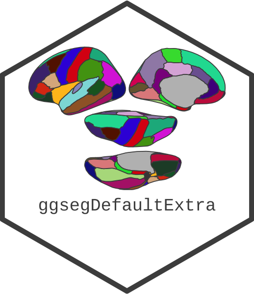
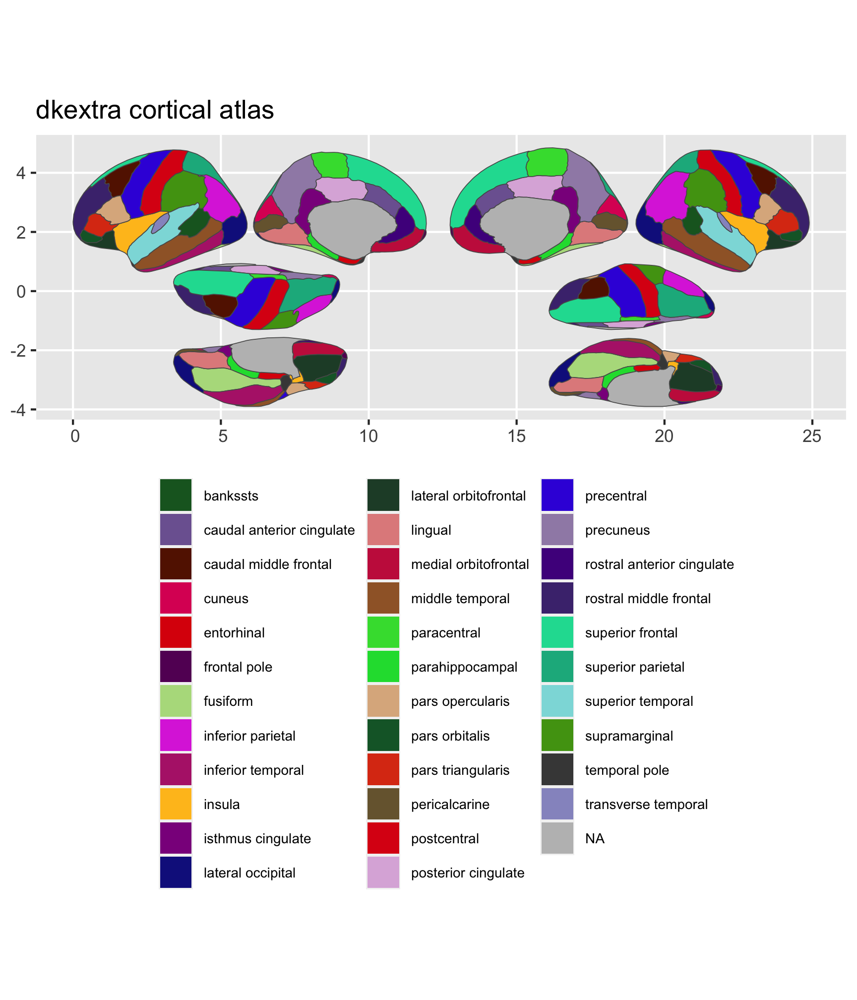

<!-- README.md is generated from README.Rmd. Please edit that file -->

# ggsegDefaultExtra 

<!-- badges: start -->

[](https://zenodo.org/badge/latestdoi/250292657)
[](https://codecov.io/gh/LCBC-UiO/ggsegDefaultExtra?branch=master)
[](https://github.com/LCBC-UiO/ggsegDefaultExtra/actions)
<!-- badges: end -->

This package contains dataset for plotting the extra datasets based on
the default ggseg and ggseg3d atlases: Desikan-Killany cortical atlas
(`dk`) and the aseg subcrotical atlas.

`dkextra` contains both superior and inferior views of the inflated
brain for the dk-atlas  
`hcpa_3d` contains the aseg atlas, with additional division of the
hippocampus into anterior and posterior parts

## Installation

We recommend installing the ggseg-atlases through the ggseg
[r-universe](https://ggseg.r-universe.dev/ui#builds):

``` r
# Enable this universe
options(repos = c(
    ggseg = 'https://ggseg.r-universe.dev',
    CRAN = 'https://cloud.r-project.org'))

# Install some packages
install.packages('ggsegDefaultExtra')
```

You can install the released version of ggsegDefaultExtra from
[GitHub](https://github.com/) with:

``` r
# install.packages("remotes")
remotes::install_github("LCBC-UiO/ggsegDefaultExtra")
```

## Example

This is a basic example which shows you how to solve a common problem:

``` r
library(ggsegDefaultExtra)
```

``` r
library(ggseg)
library(ggplot2)

plot(dkextra) +
  theme(legend.position = "bottom",
        legend.text = element_text(size = 7)) +
  guides(fill = guide_legend(ncol = 3))
```



``` r
library(ggseg3d)
library(dplyr)

ggseg3d(atlas = hcpa_3d) %>% 
  add_glassbrain("left") %>% 
  pan_camera("right lateral")
```


