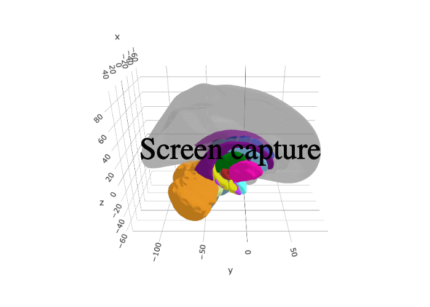

<!-- README.md is generated from README.Rmd. Please edit that file -->

# ggsegDefaultExtra

<!-- badges: start -->

[](https://travis-ci.org/LCBC-UiO/ggsegDefaultExtra)
[](https://ci.appveyor.com/project/LCBC-UiO/ggsegDefaultExtra)
[](https://codecov.io/gh/LCBC-UiO/ggsegDefaultExtra?branch=master)
<!-- badges: end -->

This package contains dataset for plotting the extra datasets based on
the default ggseg and ggseg3d atlases: Desikan-Killany cortical atlas
(`dk`) and the aseg subcrotical atlas.

`dkextra` contains both superior and inferior views of the inflated
brain for the dk-atlas  
`hcpa_3d` contains the aseg atlas, with additional division of the
hippocampus into anterior and posterior parts

## Installation

You can install the released version of ggsegDefaultExtra from
[GitHub](https://github.com/) with:

``` r
# install.packages("remotes")
remotes::install_github("LCBC-UiO/ggsegDefaultExtra")
```

## Example

This is a basic example which shows you how to solve a common problem:

``` r
library(ggsegDefaultExtra)
```

``` r
library(ggseg)

plot(dkextra) +
  theme(legend.position = "bottom",
        legend.text = element_text(size = 7)) +
  guides(fill = guide_legend(ncol = 3))
```


``` r
library(ggseg3d)

ggseg3d(atlas = hcpa_3d) %>% 
  add_glassbrain("left") %>% 
  pan_camera("right lateral")
```


